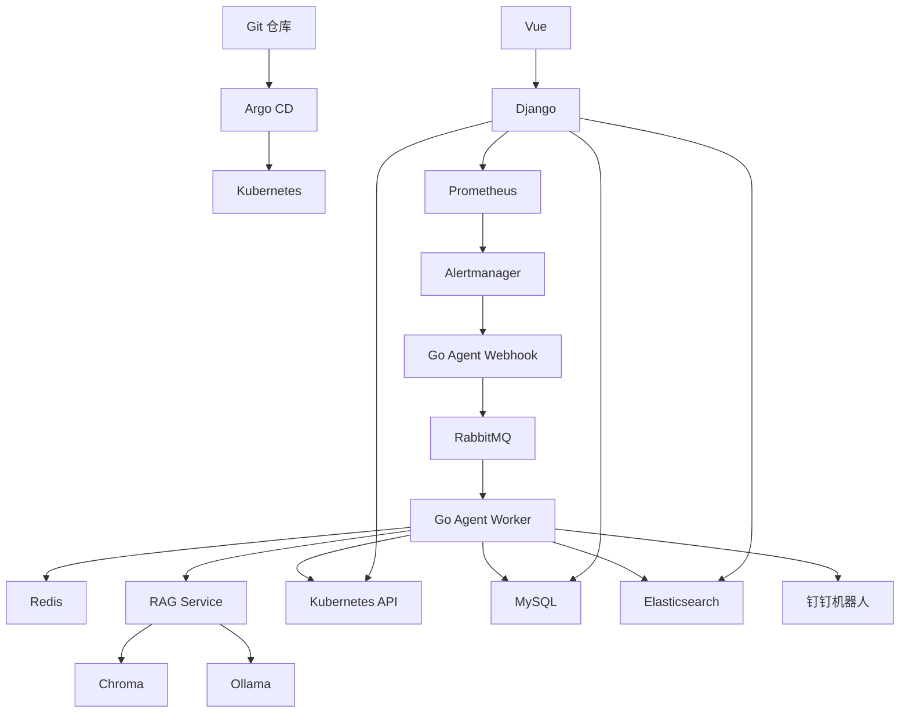

# K8s SRE 智能运维助手

> 云原生智能运维项目：Kubernetes + Prometheus/Alertmanager + Go Agent + RabbitMQ + Redis + RAG/Ollama + Django/Vue + MySQL/Elasticsearch + Helm/GitOps。

## 1. 项目一句话介绍

本项目实现了一个可以自动感知 Kubernetes 故障、通过 RAG + 大模型生成处置建议、并按白名单动作自动执行自愈的 SRE 智能运维助手。它覆盖集群搭建、监控告警、消息队列削峰、分布式锁、缓存、日志检索、可视化面板、Helm 一键部署和 LoRA 微调，适合作为 SRE / 运维开发 / 云原生方向的面试项目。

## 2. 推荐面试表述

我做的是一个 K8s SRE 智能运维助手。底层用 Ansible 自动搭建 Kubernetes 集群，用 Argo CD 实现 GitOps 部署；监控层使用 kube-prometheus-stack 采集指标并通过 Alertmanager 发送 Webhook；核心 Agent 使用 Go 开发，接收告警后先写入 RabbitMQ，Worker 异步消费，借助 Redis 做分布式锁和大模型结果缓存，调用 RAG 服务检索运维知识库，再调用 Ollama/Qwen 生成结构化决策，最后按安全白名单执行 Pod 重启、节点隔离驱逐、Deployment 回滚、ConfigMap 回滚等操作。故障处理记录写入 MySQL，运行日志写入 Elasticsearch，并通过 Django + Vue 面板展示。

## 3. 架构图



## 4. 功能清单

| 模块 | 功能 | 面试考点 |
|---|---|---|
| Ansible | 一键搭建 1 Master + 2 Worker K8s 集群 | 自动化运维、幂等、批量部署 |
| Argo CD | GitOps 应用同步 | 声明式交付、自动修复漂移 |
| Prometheus/Grafana | 指标采集和可视化 | 监控体系、PromQL、告警 |
| Alertmanager | 告警路由 Webhook | 告警聚合、抑制、路由 |
| Go Agent | 告警接收、决策、自愈 | client-go、并发、重试、幂等 |
| RabbitMQ | 告警异步队列 | 解耦、削峰、可靠消费 |
| Redis | 缓存、分布式锁、限流 | SetNX、TTL、热点保护 |
| RAG | 运维知识库增强大模型 | 向量检索、Chroma、Embedding |
| Ollama/Qwen | 本地 LLM 推理 | 私有化 AI、Prompt、JSON 决策 |
| Django API | 故障记录、日志、集群状态接口 | 后端 API、数据库、可观测性 |
| Vue 面板 | Dashboard、故障列表、日志检索 | 前端可视化、项目展示 |
| Elasticsearch/Kibana | Agent 日志存储与检索 | 倒排索引、日志平台 |
| MySQL | 故障处理记录 | 事务、结构化数据 |
| Helm | 一键部署应用 | Chart、Values、模板化 |
| LoRA | SRE 语料轻量微调 | PEFT、QLoRA、模型适配 |

## 5. 目录结构

```text
sre-assistant-final/
├── README.md
├── ansible-k8s-deployment/        # Ansible 一键搭建 K8s
├── agent/                         # Go SRE Agent，含 Webhook + Worker
├── rag-service/                   # Flask + Chroma RAG 服务
├── backend/                       # Django REST API
├── frontend/                      # Vue3 可视化面板
├── helm/sre-assistant/            # SRE 应用 Helm Chart
├── k8s/                           # 独立 K8s YAML、监控规则、故障模拟
├── lora/                          # LoRA 微调脚本和训练数据
└── scripts/                       # 一键安装、部署、验证脚本
```

## 6. 环境要求

推荐实验环境：3 台虚拟机，每台 2C4G 以上；如果只有一台 8C16G，可以用单节点 K8s 或 kind/minikube 降级部署。

默认节点规划：

| 节点 | IP | 角色 |
|---|---|---|
| k8s-node1 | 192.168.30.11 | Master / 控制平面 |
| k8s-node2 | 192.168.30.12 | Worker |
| k8s-node3 | 192.168.30.13 | Worker |

软件版本建议：

| 软件 | 建议版本 |
|---|---|
| Kubernetes | 1.29+ / 1.30+ / 1.32 均可 |
| containerd | 1.6+ |
| Helm | 3.12+ |
| Go | 1.22+ |
| Python | 3.10+ |
| Node.js | 18+ |
| Docker | 24+ |

## 7. 快速开始

### 7.1 搭建 K8s 集群

```bash
cd ansible-k8s-deployment
ansible-galaxy collection install -r requirements.yml
ansible-playbook deploy-k8s.yml
kubectl get nodes -o wide
```

如果你已有 K8s 集群，可以跳过 Ansible。

### 7.2 安装基础组件

```bash
cd scripts
bash 01_install_tools.sh
bash 02_install_observability.sh
bash 03_install_middlewares.sh
bash 04_install_ollama.sh
```

### 7.3 构建镜像

把 `REGISTRY` 换成你的镜像仓库，例如 `registry.cn-hangzhou.aliyuncs.com/xxx` 或 Docker Hub 用户名。

```bash
export REGISTRY=你的镜像仓库地址
bash scripts/05_build_images.sh
```

### 7.4 修改 Helm 配置

```bash
cd helm/sre-assistant
cp values.example.yaml values.yaml
vim values.yaml
```

至少修改：

```yaml
global:
  imageRegistry: "你的镜像仓库地址"
agent:
  dingTalkWebhook: "https://oapi.dingtalk.com/robot/send?access_token=xxx"
```

### 7.5 一键部署 SRE 应用

```bash
helm upgrade --install sre-assistant ./helm/sre-assistant \
  -n sre-assistant --create-namespace \
  -f ./helm/sre-assistant/values.yaml
```

### 7.6 应用告警规则和 Alertmanager 路由

```bash
kubectl apply -f k8s/monitoring/prometheus-rules.yaml
kubectl apply -f k8s/monitoring/alertmanager-config.yaml
```

### 7.7 加载 RAG 知识库

```bash
kubectl port-forward -n sre-assistant svc/sre-rag-service 8000:8000
curl -X POST http://127.0.0.1:8000/load_knowledge \
  -H 'Content-Type: application/json' \
  -d '{"path":"/data/sre_manual.txt"}'
```

### 7.8 验证系统

```bash
bash scripts/06_verify.sh
kubectl apply -f k8s/faults/crashloop.yaml
kubectl apply -f k8s/faults/oomkilled.yaml
kubectl apply -f k8s/faults/imagepullbackoff.yaml
```

## 8. 面试可演示流程

1. 打开 Grafana，展示集群 CPU/内存/Pod 状态。
2. 部署 `k8s/faults/crashloop.yaml`，触发 CrashLoopBackOff。
3. PrometheusRule 产生告警，Alertmanager 发送 Webhook 到 Agent。
4. Agent 把告警写入 RabbitMQ，Worker 消费。
5. Worker 用 Redis SetNX 对故障加锁，避免重复处理。
6. Worker 调用 RAG 检索知识库，再调用 Ollama 生成 JSON 决策。
7. Agent 执行删除 Pod，由 Deployment 自动拉起新 Pod。
8. Agent 把处理记录写 MySQL，把日志写 Elasticsearch，并发送钉钉通知。
9. 打开 Vue 面板，展示故障历史和日志。

## 9. 安全边界设计

大模型只负责给建议，不直接拥有执行权限。Agent 只接受白名单动作：

| Action | 实际执行 |
|---|---|
| RESTART_POD | 删除故障 Pod，由控制器重建 |
| EVICT_NODE | 标记节点不可调度，并通过 Eviction API 驱逐普通 Pod |
| ROLLBACK_DEPLOYMENT | 用上一版 ReplicaSet 的 PodTemplate 覆盖 Deployment |
| ROLLBACK_CONFIGMAP | 用 `xxx-previous` ConfigMap 覆盖当前 ConfigMap |
| DIAGNOSE_ONLY | 只记录建议，不执行变更 |

所有执行动作都有：分布式锁、重试、日志记录、通知、审计字段。

## 10. 常见问题

### Q1：为什么不用大模型直接执行 kubectl？

因为生产环境不能让大模型直接操作集群。正确做法是让模型输出结构化 JSON，Agent 根据白名单动作执行固定逻辑。

### Q2：为什么用 RabbitMQ？

Alertmanager 告警可能瞬时很多，直接处理会阻塞 Webhook。RabbitMQ 可以解耦告警接收和故障处理，支持削峰和异步消费。

### Q3：为什么 Redis 既做缓存又做锁？

Redis 的 SetNX + TTL 很适合做轻量分布式锁，避免多个 Worker 重复处理同一故障；同时缓存 LLM 决策，减少重复调用模型。

### Q4：为什么 RAG 和 LoRA 都做？

RAG 解决知识实时性和可解释性，LoRA 解决模型输出风格和领域术语适配。实际落地先做 RAG，LoRA 作为增强项。

### Q5：这个项目是不是过度设计？

项目故意覆盖 SRE 高频考点，但每个中间件都有实际作用：RabbitMQ 负责削峰，Redis 负责锁和缓存，MySQL 存结构化记录，Elasticsearch 存日志，Prometheus 负责告警，不是为了堆技术栈。

## 11. 生产化改进方向

- 引入审批流：高风险动作只生成工单，不自动执行。
- 引入多租户 RBAC：按 namespace 限权。
- 引入 OpenTelemetry：统一 traces/metrics/logs。
- 接入企业工单系统：Jira/飞书/钉钉审批。
- 引入规则引擎：LLM 之前先走确定性规则。
- 增加回滚保护：连续失败自动停止自愈。
